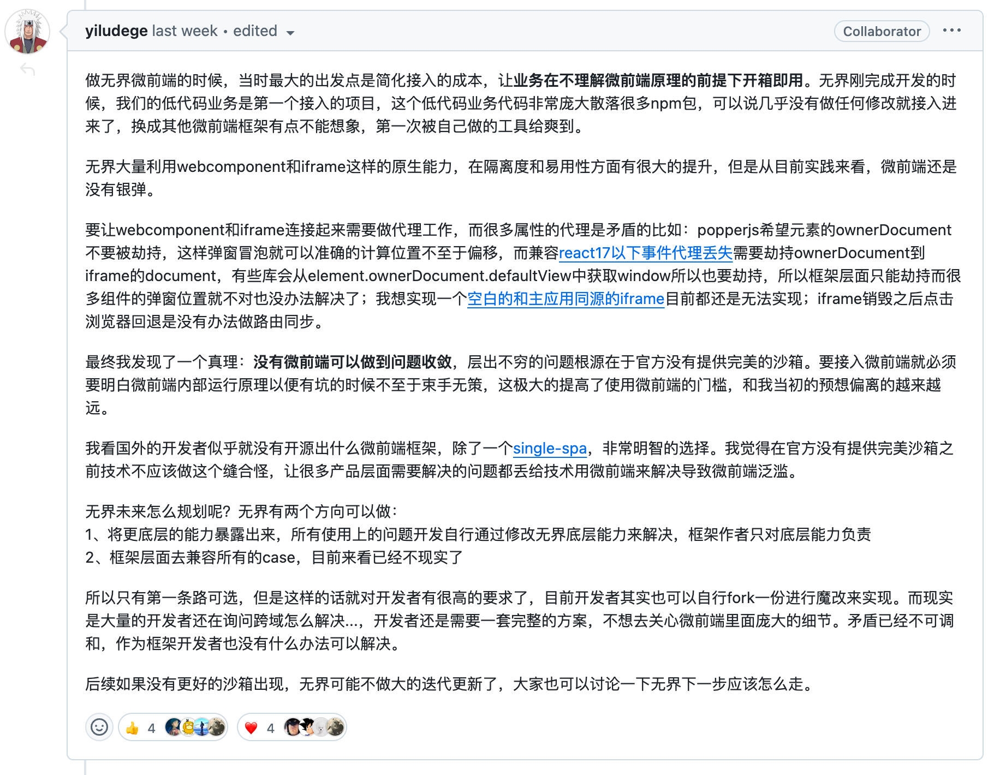

# awesome-frontend

随着项目的进行，需求的不断增多，如果将所有前端代码都放在一个项目中，前端项目将变得不太容易维护。因此，“微前端”的概念被提出，旨在最小化管理前端页面，让开发人员更专注于一块功能的开发。

但是，就目前而言，浏览器环境没有对微前端有很好的原生支持：`<iframe />`标签虽然能实现“输入url，加载新的页面”，但是由于性能问题以及经常遇见的跨域问题—更重要的是，无法与浏览器路由同步，导致其并不好用。

> `<iframe />`标签本质上是根据url完整渲染一个新的dom树嵌入在原本dom节点内部，因此需要很大的内存容量


## 如何启动本项目

本项目是基于后端实现网关前端微应用的一个演示项目，其中，后端网关使用traefik，前端微应用使用vue3+vite和next.js14。
本项目作为一个演示项目，包含了一个vue3+vite的前端项目和两个next.js14的前端项目，其中，next.js作为项目基座，vue3+vite和另一个next.js作为微应用。

如果你想要启动本项目，你需要安装docker和docker-compose和nodejs 18+，然后：

1. 在项目根目录下执行`npm install`安装依赖，然后执行`npm run dev`启动next.js项目
2. 在`/micro/vue-micro-app`目录下执行`npm install`安装依赖，然后执行`npm run dev`启动vue3+vite项目
3. 在`/micro/next-micro-app`目录下执行`npm install`安装依赖，然后执行`npm run dev`启动next.js项目
4. 在`/gateway`目录下执行`docker-compose up -d`启动traefik网关，随后，你就能在`http://localhost:8080`访问到项目了


## 主流微前端框架介绍

就目前而言，流行的微前端框架主要有：

1. [single-spa](https://github.com/single-spa/single-spa)：国外框架，提出“应用注册表”，用于管理应用的生命周期
2. [qiankun](https://github.com/umijs/qiankun)：基于single-spa，由阿里团队开发。改进了single-spa的“应用注册表机制”，使应用更容易被挂载，对原本应用入侵性更小，并且实现了样式隔离。
3. [mirco-app](https://github.com/micro-zoe/micro-app)：基于web component，由京东团队开发。相比于上面两种框架，mirco-app的方案更原生，性能更好。
4. [emp](https://github.com/empjs/emp)：一款企业级微前端框架，webpack联邦编译可以保证所有子应用依赖解耦
5. [wujie](https://github.com/Tencent/wujie)：由腾讯团队开发，基于web component和iframe，相比mirco-app效果更好，并且弥补了iframe容易出现的跨域问题

除了single-spa和emp，其余几个我都使用了一遍，他们或多或少都存在几个问题([#1](https://github.com/SAKURA-CAT/awesome-frontend/issues/1))：

1. 不支持（或者支持得不好）新的应用打包工具vite
2. 不支持next.js11+的app模式，甚至如qiankun并不支持next.js（实际上是single-spa不支持）
3. 一般只用于客户端渲染，因此如next.js存在部分兼容性问题

在使用的过程中我也发现微前端框架更多为国内研发，这是一件比较诡异的事情，并且，多数微前端框架的更新频率已经放缓。[wujie的开发者的issue回复](https://github.com/Tencent/wujie/issues/895#issuecomment-2320336309)从侧面回答了这个问题：



所以总之，**前端解耦是一个真需求，但是微前端框架是一个伪命题**，由于各种框架的方案和版本差异，微前端框架是没有办法收敛的。

那么回到项目本身，如何继续解耦工作呢？事实上，纯前端的路无法走通，我们可以尝试前后端协同工作来实现，接下来从技术选型讲起。

## 前端解耦

现在我们有这么一个需求，有一个vue3+vite打包实现的前端渲染项目，但是随着项目的发展，需要增加许多其他的业务，这些业务之间的关联性并不强（就像美团的电影和外卖分属两个不同的模块一样），并且，考虑到学习新的技术，新模块将采用next.js14的新特性[app模式](https://nextjs.org/docs#app-router-vs-pages-router)搭建。

### 腾讯云的前端解耦例子

腾讯云的业务有很多，它的解耦方案将会给我们一些启发：腾讯云将不同的业务放在不同的子域名下，然后在点击时跳转到指定域名，这样做的好处是不必担心路由冲突的问题，不过坏处也很明显，域名不统一的坏处会给用户带来不太好的体验，特别是对于需要有社交体验的项目上。

> 当然，腾讯云不需要有社交体验，因此使用子域名的方式是合理的。

### 使用路由区分

回到项目本身，显然我们要求项目归属于一个域名，因此区分业务的唯一方式变成了路由——但是具体实现与域名区分是类似的，只是需要精细化划分。

我们知道，前端本质上是写一串脚本然后交给浏览器环境执行，服务端渲染（next.js）与客户端渲染（vue3）最大的区别在于前者由服务端构建完整html内容，而后者在客户端构建html内容。但是本质上都是通过网络请求获取脚本代码（包括html和js等代码）然后浏览器完成相应展示，因此本质上我们可以通过请求地址（url路由）区分他们。

对于一个标准vite打包的vue3项目，除了public文件夹的内容，其余内容都会被打包到`assets`目录下，并且此名称可以在打包时修改。因此我们只需要在网关层做好路由转发即可，假设我们的vue项目的打包目录为`vue-mirco-app-assets`，那么我们可以使用traefik网关配置如下（docker模式，实际生产中为kubenetes模式，这里只是举个例子）：

```yaml
http:  
  routers:  
    vue-router:  
      rule: "PathPrefix(`/vue-mirco-app`) || PathPrefix(`/vue-mirco-app-assets`)"  
      service: vue-app  
    next-router:  
      rule: "!PathPrefix(`/vue-mirco-app`) && !PathPrefix(`/vue-mirco-app-assets`)"  
      service: next-app  
  
  services:  
    vue-app:  
      loadBalancer:  
        servers:  
          - url: "http://host.docker.internal:3002/"  
    next-app:  
      loadBalancer:  
        servers:  
          - url: "http://host.docker.internal:3000/"
```

其中`/vue-mirco-app`为微应用前缀，实际生产中需要根据不同情况进行路由规则调整。此外，在vue中，唯二需要调整的是：

1. 路由跳转的标签，vue框架下的RouterLink组件为前端导航，如果设置为`/`，无法跳转出`vue-mirco-app`，需要改用原生a标签。
2. public目录在子应用模式下被禁止使用，或者根据public内容更新路由网关规则。

> 路由为history模式，并且设置base为`/vue-mirco-app`

如上即可实现next.js与vue的隔离，本质上是通过后端网关合并两个网站服务实现的。


### next.js原生微应用

next.js是后端渲染项目，相应的也会有代理功能——在next.js中称为`rewrites`。之所以不叫`proxy`，是因为它的功能并不局限于请求代理转发，也可以实现同一框架下的app调度。

假设有一个新的next.js微应用需要嵌入到主应用中，此时我们不需要更改后端网关配置，只需要在主应用中配置一下`rewrites`：

```js
/** @type {import('next').NextConfig} */  
const nextConfig = {  
  rewrites: async () => {  
    return [  
      {  
        source: "/next-mirco-app/:path*",  
        destination: "http://localhost:3001/:path*",  
      },  
    ];  
  },  
};  
  
export default nextConfig;
```

那么对于next.js微应用而言，自然就嵌入了主应用中，并且在同一前端dom树下，所以资源（cookie等信息）共享。
